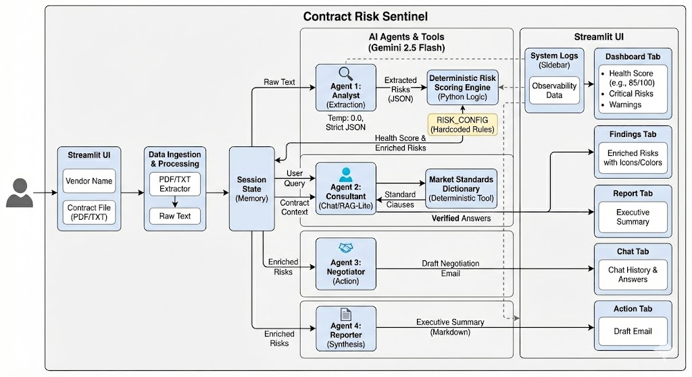

# 🛡️ Contract Risk Sentinel (Enterprise Edition)

### Kaggle Agents Intensive Capstone Project
**Track:** Enterprise Agents
**Model:** Google Gemini 2.5 Flash

---

## 1. Problem Statement
Legal contract review is a bottleneck for modern businesses. Small business owners and freelancers often sign contracts without reading the fine print because hiring a lawyer is expensive ($500+/hr) and time-consuming. This leads to "agreement fatigue," where users accept predatory clauses—like unlimited liability or 10-year non-competes—without realizing the financial risk.

## 2. Solution Statement
**Contract Risk Sentinel** is an AI-powered Risk Assessment Application that democratizes legal leverage. It uses a deterministic multi-agent system to instantly audit contracts, identifying risky clauses against a hard-coded database of market standards. Unlike generic chat tools, it separates "fact extraction" from "risk scoring" to provide consistent, hallucination-free risk assessments.

## 3. Value Statement
By automating the "first pass" of legal review, this tool reduces contract audit time from **hours to seconds**. It empowers non-lawyers to identify "Red Flag" clauses immediately and provides actionable negotiation drafts, effectively acting as a 24/7 fractional General Counsel for freelancers and SMEs.

---

## 4. Architecture



We utilized a **Vertical Layered Multi-Agent Architecture** where agents have distinct, isolated responsibilities to ensure stability:

* **Agent 1 (The Analyst):** A "Zero-Shot Extractor" that reads raw text and outputs structured JSON boolean facts.
* **Agent 2 (The Scorer):** A deterministic Python logic engine (not AI) that calculates a math-based health score.
* **Agent 3 (The Consultant):** A "RAG-Lite" agent that answers user questions by cross-referencing a dictionary of Market Standards.
* **Agent 4 (The Negotiator):** An action agent that drafts professional emails to push back on identified risks.

## 5. Workflow
The data flows sequentially through the system:
1.  **Ingestion:** User uploads PDF/TXT -> Text is extracted via `pypdf`.
2.  **Extraction:** Analyst Agent scans text -> Outputs JSON of detected clauses.
3.  **Scoring:** Python Engine maps clauses to `RISK_CONFIG` -> Calculates Health Score (0-100).
4.  **Interaction:** User views the Dashboard -> Chats with Consultant Agent for deep dives.
5.  **Action:** User clicks "Draft Email" -> Negotiator Agent generates the email artifact.

---

## 6. Essential Tools and Utilities
This project leverages specific technical tools to ensure Enterprise-grade reliability:

* **Google Gemini 2.5 Flash:** Chosen for its high speed and large context window (essential for long contracts).
* **Deterministic Tooling (`get_market_standards`):** A custom Python dictionary tool used to ground the AI's answers in reality, preventing legal hallucinations.
* **Streamlit Caching (`@st.cache_data`):** Used to cache expensive API calls, ensuring that re-analyzing the same file yields instant, identical results.
* **Fuzzy Matching Logic:** A custom Python algorithm to map AI output variations to strict scoring keys.

---

## 7. Installation

### Prerequisites
* Python 3.10+
* A Gemini API Key

### Steps
1.  **Clone the Repository**
    ```bash
    git clone https://github.com/Krrishn07/contractor-risk-sentinel.git
    cd contract-risk-sentinel
    ```

2.  **Install Dependencies**
    ```bash
    pip install -r requirements.txt
    ```

3.  **Configure API Key**
    Create a `.env` file in the root directory:
    ```text
    GOOGLE_API_KEY=Your Key Here
    ```

4.  **Run the Application**
    ```bash
    streamlit run run.py
    ```

---

## 8. Project Structure
The codebase follows a modular Enterprise software pattern to separate Logic, UI, and Config:

```text
contract-risk-sentinel/
├── run.py                  # Application Entry Point
├── .env                    # API Credentials
├── sample_contracts/       # sample contact files(PDF, .txt)
├── requirements.txt        # Install the required libraries
├── src/
│   ├── config.py           # Scoring Rules & Risk Configuration
│   ├── tools.py            # Market Standards Knowledge Base
│   ├── agents.py           # Gemini Model Initializations
│   ├── logic.py            # Scoring Math Engine
│   ├── utils.py            # PDF Processing Utilities
│   └── interface.py        # Streamlit UI Components
